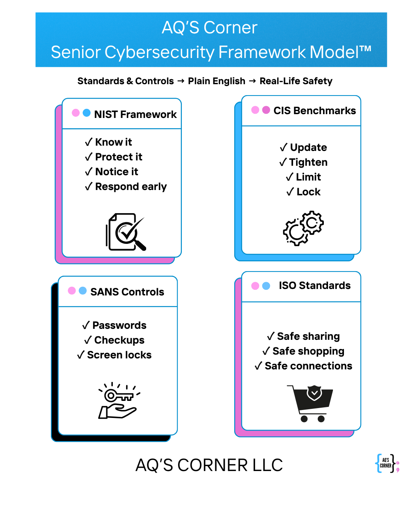

# AQ’S Corner Senior Cybersecurity Framework Model™

A human-centered cybersecurity framework for seniors — and for the people who support and train them.

This repository hosts the **AQ’S Corner Senior Cybersecurity Framework Model™**, a modern, practical adaptation of four major cybersecurity frameworks:

- **NIST** (National Institute of Standards and Technology)  
- **CIS Benchmarks** (Center for Internet Security)  
- **SANS Controls**  
- **ISO Standards** (International Organization for Standardization)

The mission is simple:

> **Make cybersecurity teachable, believable, and usable for seniors — without losing the integrity of the original frameworks.**

---

## 🌐 The Framework at a Glance

**The four pillars of the model are:**

- **Awareness & Devices (NIST)**  
- **Settings & Privacy (CIS)**  
- **Digital Habits & Credentials (SANS)**  
- **Online Safety & Behavior (ISO)**  

This model restructures major cybersecurity frameworks into clear, plain-English actions that seniors can understand and apply daily.

---

## 🔵 Pillar 1 — Awareness & Devices  
### (NIST → Identify, Protect, Detect, Respond, Recover)

- **Know it** — Understand your devices and accounts.  
- **Protect it** — Use passwords, updates, and built-in protections.  
- **Notice it** — Spot unusual pop-ups, messages, or logins.  
- **Respond early** — Ask for help as soon as something feels off.

---

## 🟪 Pillar 2 — Settings & Privacy  
### (CIS Benchmarks → Device Hardening)

- **Update** — Keep devices and apps current.  
- **Tighten** — Strengthen privacy and security settings.  
- **Limit** — Restrict unnecessary app permissions.  
- **Lock** — Use screen locks and device safeguards.

---

## 🟨 Pillar 3 — Digital Habits & Credentials  
### (SANS Controls → Everyday Safety)

- **Passwords** — Use strong, memorable passphrases.  
- **Checkups** — Review accounts, apps, and settings regularly.  
- **Screen locks** — Ensure devices auto-lock when unused.

---

## 🟩 Pillar 4 — Online Safety & Behavior  
### (ISO Standards → Global Online Trust & Safety)

- **Safe sharing** — Protect personal information.  
- **Safe shopping** — Verify websites before entering payment details.  
- **Safe connections** — Be cautious with Wi-Fi and unsolicited messages.

---

## 🎯 Purpose of the Framework

People of all ages and backgrounds express concerns about cybersecurity and aging — especially the assumption that certain groups “can’t learn this.”

This framework challenges that narrative.

It exists to:

- Equip seniors with practical digital safety skills  
- Support caregivers and community leaders in teaching cybersecurity  
- Bridge generational digital gaps  
- Build confidence, not fear  
- Ensure cybersecurity belongs to **every** generation

It is designed for:

- Libraries  
- Senior centers  
- Church groups  
- Veteran communities  
- AARP chapters  
- Families  
- Caregivers  
- Educators  
- Workplaces  

---

## 🚀 Senior CyberHero Missions (Coming Soon)

This model is the foundation for upcoming **Senior CyberHero Missions** — guided digital safety activities and printable resources designed specifically for older adults.

All future missions and training tools will align with the four pillars of this framework.

---

## 🧭 How to Use This Repository

Use this framework to:

- Train seniors directly  
- Train librarians, caregivers, and senior center staff  
- Develop workshops or programs  
- Build safety checklists and handouts  
- Support multigenerational learning  
